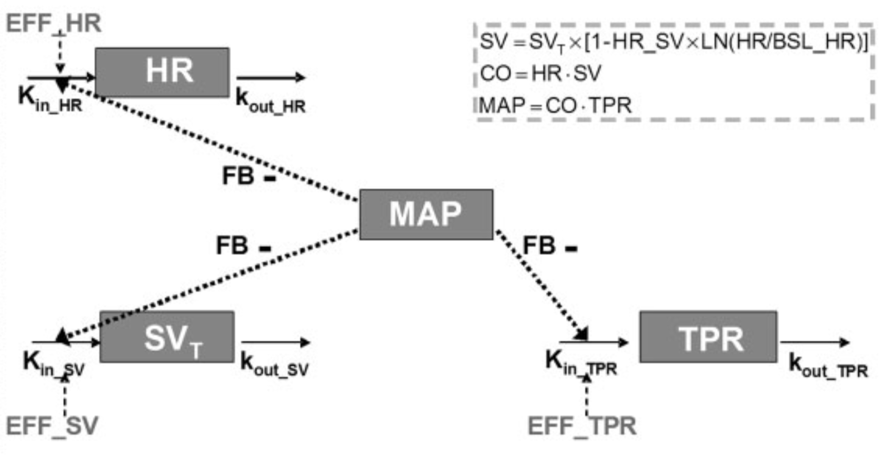

# Hemodynamic Simulator
Author: Y. Fu  
Date: 2019.03.31

###1. Model information

$$
\begin{aligned}
\rm{\frac{dHR}{dt}} & =  \rm{K_{in\_{HR}}\cdot(1+{CR}_{HR})\cdot(1-FB\cdot{MAP})\cdot(1+EFF)-k_{out\_HR}\cdot{HR}}\\
\rm{\frac{dSV_T}{dt}} & =  \rm{K_{in\_{SV}}\cdot(1-FB\cdot{MAP})\cdot(1+EFF)-k_{out\_SV}\cdot{SV_T}}\\
\rm{\frac{dTPR}{dt}}  & =  \rm{K_{in\_{TPR}}\cdot(1+{CR}_{TPR})\cdot(1-FB\cdot{MAP})\cdot(1+EFF)-k_{out\_TPR}\cdot{TPR}}\\
\rm{SV} & = \rm{SV_T\times\left[1-HR\_SV\times{LN}(HR/BSL\_HR)\right]}\\
\rm{CO} & = \rm{HR \cdot{SV}}\\
\rm{MAP} & = \rm{CO\cdot{TPR}}\\
\rm{{CR}_{HR}} & = \rm{amp_{HR}\cdot{cos}\left(\frac{2\pi\cdot(t+hor_{HR})}{24}\right)}\\
\rm{{CR}_{TPR}} & = \rm{amp_{TPR}\cdot{cos}\left(\frac{2\pi\cdot(t+hor_{TPR})}{24}\right)}
\end{aligned}
$$